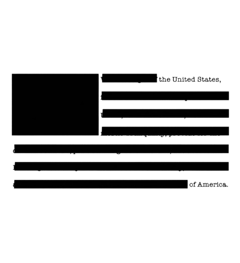

# 📦 Censor Box

**Censor Box** est une simulation de terminal de renseignement rétro-futuriste où vous incarnez un agent chargé de censurer des documents confidentiels. Le jeu combine rapidité, précision et une esthétique "Top Secret" immersive.

## 🎯 Le Concept

Votre mission est simple mais cruciale : traiter un flux de mots sensibles en les classant par taille pour les censurer correctement. Une erreur, et l'information fuite. Trop de fuites, et la mission est compromise.

## 🚀 Fonctionnalités

- **Interface Rétro Immersive** : Effet d'écran CRT, lignes de balayage (scanlines), et une ambiance sonore de suspense.
- **Système de Jeu Basé sur la Rapidité** : Identifiez la longueur des mots en un clin d'œil.
- **Niveaux de Difficulté** : Du mode "Entraînement" au mode "Agent d'Élite".
- **Rapports de Mission** : Recevez un document classifié à la fin de vos missions réussies.
- **Contrôles Réalistes** : Utilisation d'un clavier virtuel intégré et support du clavier physique.

## 🛠️ Comment Jouer ?

1.  **Identifier le mot** : Regardez le mot cible au centre de l'écran.
2.  **Analyser la taille** :
    -   **MICRO** (1-3 caractères) → Touche **1**
    -   **SMALL** (4-5 caractères) → Touche **2**
    -   **MEDIUM** (6-8 caractères) → Touche **3**
    -   **LARGE** (9+ caractères) → Touche **4**
3.  **Passer** : Appuyez sur **ESPACE** si vous avez un doute.
4.  **Réinitialiser** : Utilisez le bouton ↻ sur la console pour redémarrer le système.

## 💻 Technologies Utilisées

- **React 19**
- **TypeScript**
- **Vite**
- **Keyboard CSS** (pour le rendu des touches)
- **Lucide React** (pour les icônes)
- **CSS Custom Properties** (pour les animations CRT et le thème)

## 👤 Crédits

Développé par **Agent Moussandou** (Full Stack Developer).

- 🐙 [GitHub](https://github.com/Moussandou)
- 💼 [LinkedIn](https://www.linkedin.com/in/moussandou/)
- 🌐 [Portfolio](https://moussandou.github.io/Portfolio/)
- 📸 [Instagram](https://www.instagram.com/takaxdev/)

---

*PROPRIÉTÉ DE L'AGENCE DE RENSEIGNEMENT - ACCÈS RESTREINT*
